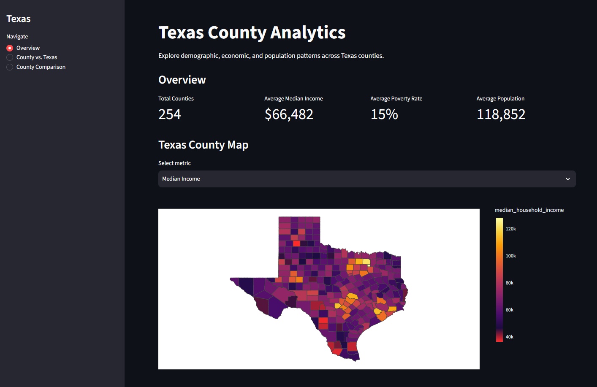
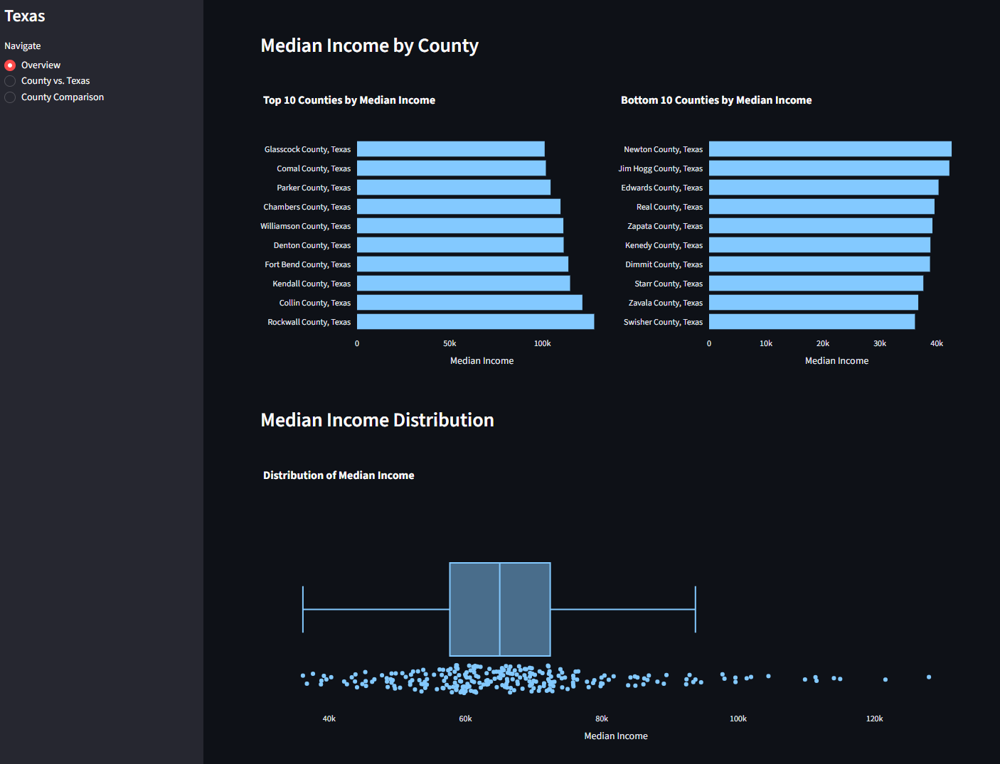
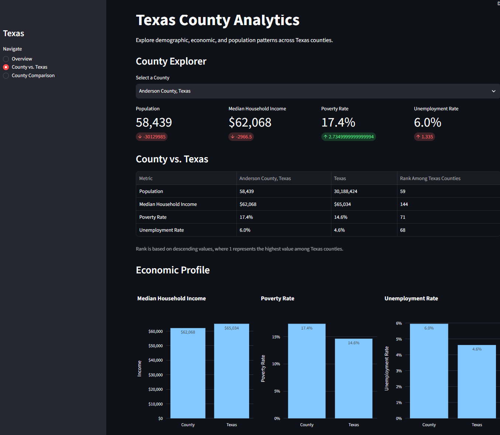
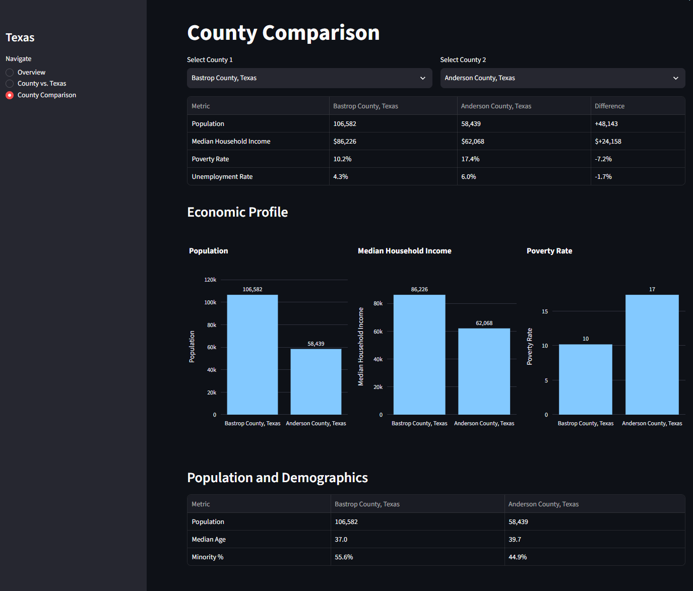

# Project Overview
The Texas County Dashboard explores trends in population, demographics, and economical profiles. Data is gathered from 
from the Census API. It's then cleaned, metrics are calculated and cached.

# Features
**Overview** - The Overview pages gives general information about Texas as a whole including the number of counties, 
average income, poverty_rate, and population. It also features a Texas map as a heatmap with counties as boundaries.  

**County vs. Texas** - This page allows the user to compare a specific county to Texas as a whole.  
  
**County Comparison** - The Comparison page allows the user to compare two specified counties.

# Data Sources
Data was collected from [Census API](https://www.census.gov/data/developers/guidance/api-user-guide.html) and then 
cached as a parquet file. The dataset contains the county, population, and economic, housing, demographic, and education 
metrics. 

# Running the ETL

1. src/texas_county_dashboards/etl/download_census.py
2. src/texas_county_dashboards/etl/clean_data.py
3. src/texas_county_dashboards/etl/merge_shapefiles.py
4. src/texas_couonty_dashboards/etl/buld_dashboard.py

# Dashboard

## Overview

## County vs. Texas

## County Comparison

# Installation and Usage

1. Clone the repository

`git clone https://github.com/sapphiremoonchaser/texas-county-dashboard.git`

2. Run the streamlit dashboard

`streamlit run src/texas_county_dashboards/dashboard/app.py`

# Future Enhancements
* Expand metrics to include housing and education metrics
* Add pages for deep dives into economics, housing, education, an demographics metrics

## Author
Heather Hill  
[LinkedIn](www.linkedin.com/in/heather-gwyn)  
[GitHub](https://github.com/sapphiremoonchaser)

